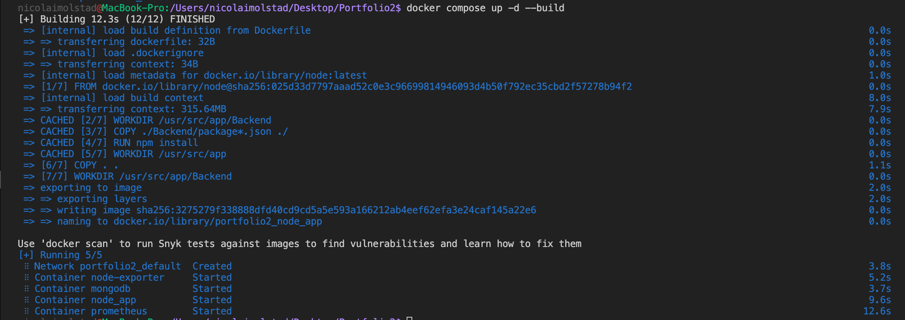
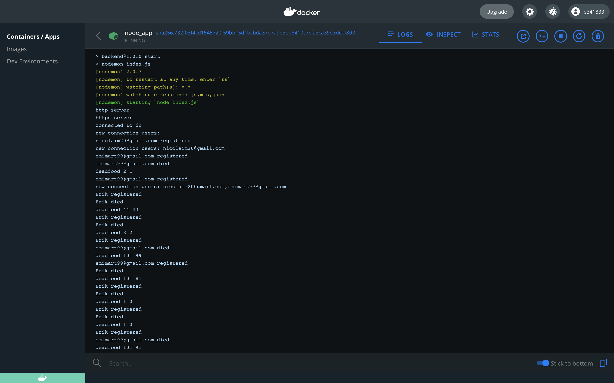
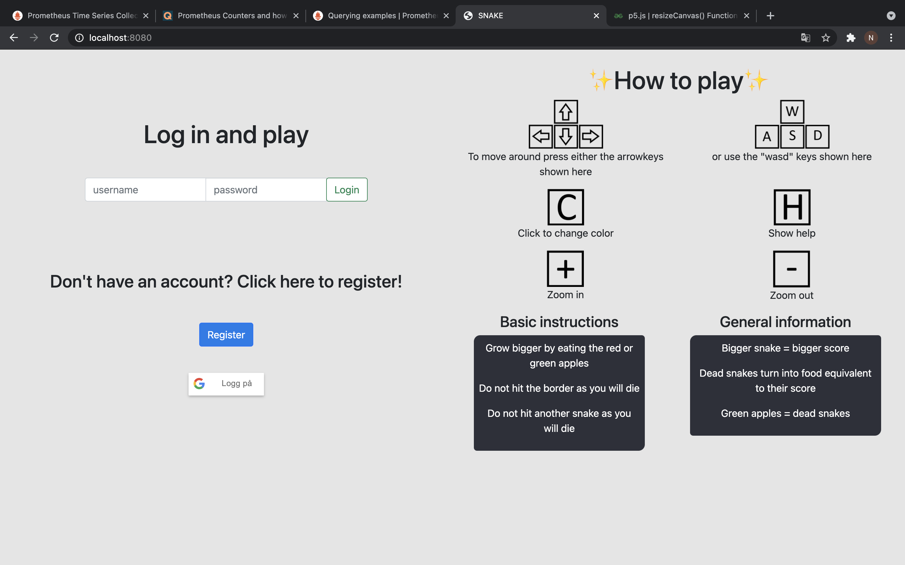
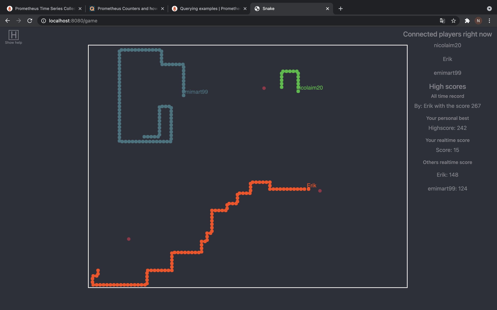
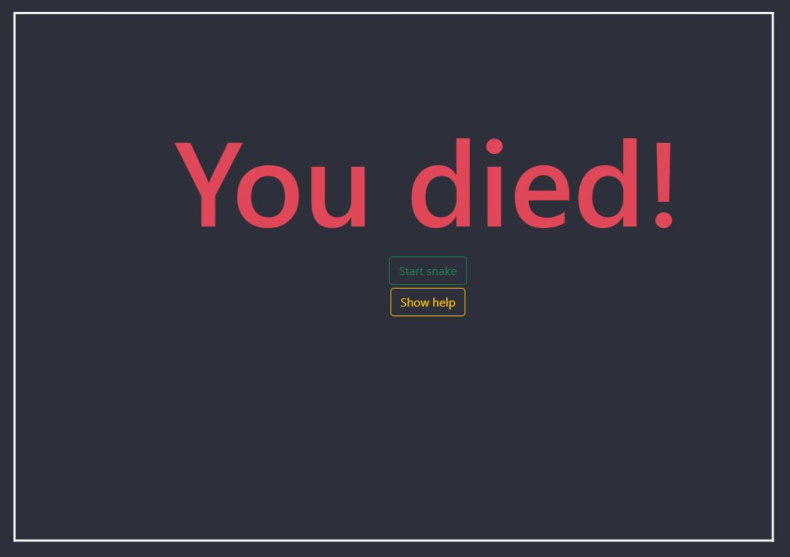
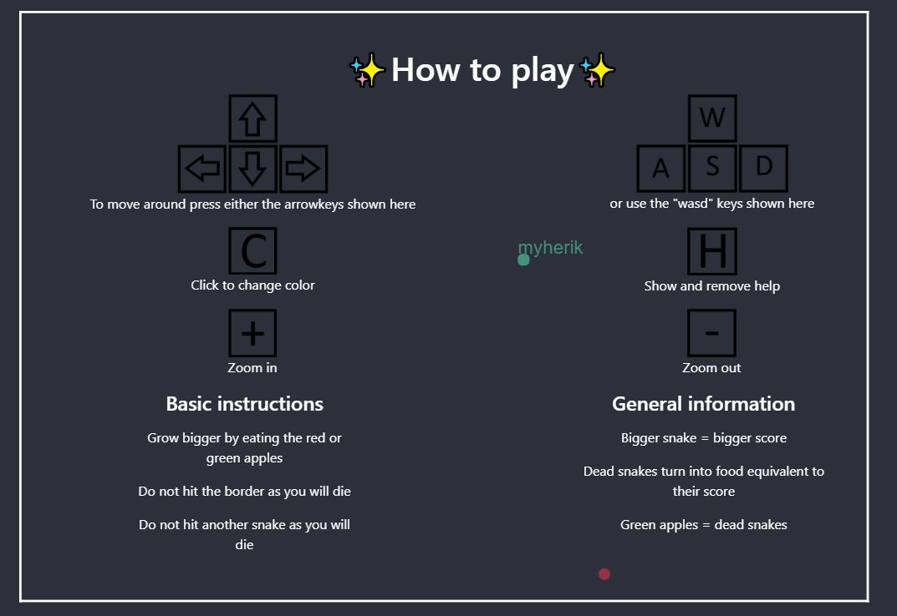
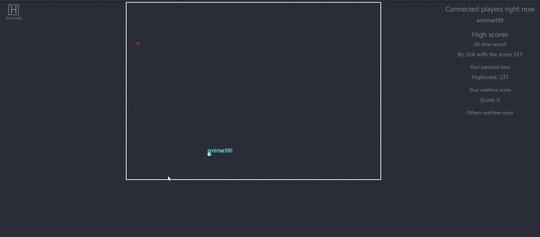
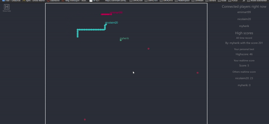
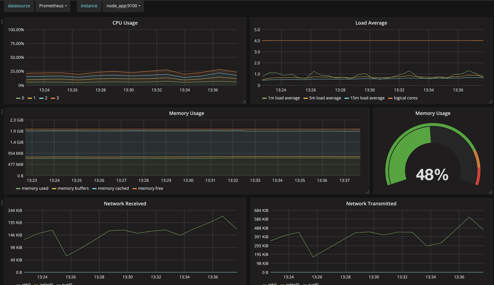

# **Portfolio2 - Snake - Group 5**

## Implementing game mechanics

---

Technology chosen: Node.js backend with html/css/javascript for graphics and socket.io for networking

The first thing we had to do was obviously to set up a basic gameboard where we figured using canvas with the p5 library was the best solution. Then we pieced together every function of the game we needed one by one. The snake itself was the natural starting point. Then we added movement, food, growing and so on.

Once we had the most basic implementation of a snake game we thought it'd be nice to start adding the multiplayer functionality with websockets. We started by registering our snake to the server and for all clients to retrieve other registered snakes. In theory this makes it possible for an infinte ammount of players.

Now that we had a functioning multiplayer snake we added features that is not totally necessary but nice to have in the game. This includes dying when hitting another snake, dead snakes turning into food and scores just to mention some of them.

Now that we had completed all the expected features we started on the stretch goals. The natural first stretch goal to start with was a database to store scores on. We used mongodb to implement this. We figured creating users was also nice for having personal best scores and improving on top score whilst noone else could have that name.

Having users also made it natural to implement API so that we have a starting page for login and instructions while the game itself could be its own thing. Other stretch goals we have implemented are https with openssl (self signed certification on port 8081), google authentication, scrolling the game, allowing for 10 < players, password hashing with bcrypt and finally prometheus with grafana. Prometheus with grafana allows us to monitor any data we would like from the project.

We decided not to implement bots on purpose as we thought it would not be good for the game.

## Running the project

---

Deployment with docker is necessary. To start hosting use the following command.

```
docker compose up --build -d
```

Alternatively you could run the project in seperate docker containers with these commands

```
docker network create skynet

docker build -t snake-server .

docker run --network skynet --name mongodb -v $(pwd)/mongodb/data:/data/db -e MONGO_INITDB_ROOT_PASSWORD=root -e MONGO_INITDB_USERNAME=root -d mongo

docker run --network skynet --name node_app -p 8080:8080 -p 8081:8081 snake-server

docker run --network skynet --name prometheus -p 9090:9090 -v $(pwd)/Prometheus/prometheus.yml:/etc/prometheus prom/prometheus

docker run --network skynet --name grafana - 3000:3000 -v $(pwd)/Grafana:/var/lib/grafana stefanwalther/grafana
```

Now if you enter a browser and type in: http://localhost:8080 or alternatively for secure connection: https://localhost:8081 you should be able to get to the login page. If you enter with the https you have to approove it yourself as most browsers will not say it is a valid certification. Sign in with google is not available on google chrome with https, as google do not accept the certification. To be able to use TLS/SSL we had to sign our own certificate since we dont have a domain. We used openssl for this.

```
openssl genrsa -out key.pem

openssl req -new -key key.pem -out csr.pem

openssl x509 -req -days 365 -n csr.pem -signkey key.pem -out cert.pem

```

We have also used the OsloMet linux VM to host for testing purposes, so that we could test within the group without being on the same network. This gave us the address os13.vlab.cs.hioa.no:8081 where anyone on the internet could come in and try. This was very useful in testing the multiplayer mechanics, as we have not been able to meet in person due to the world conditions.

## Interaction with the end product

---

You will get instructions on how to play the game on the login page as well.

To start the game you have two options. You can log in with a user or through google. If you do not have a user/google account and/or do not wish to use google you can easily create a user by clicking the 'Register' button. When having clicked the register button you can fill in the input field with a username and password of your choice as long as username is not already registered in the database.

Test user is already created for testing where you can input admin as both username and password in the input fields for login.

Once logged in you are immediately placed in the game, but you are just standing still. You can start moving in any of direction by pressing either the arrowkeys or the 'WASD' keys on your keyboard. The entirety of the game is played with these keys, but there are a few additional keys available. You can press the 'C' key if you are not happy with the colour of your snake, and you'll be given another random colour. If you want the game zoomed more in or out you can press the keys '-' or '+' respectively. We also have the keypress 'H' for help.

When moving, the goal of the game is to get the highest possible score. Move towards the red or green circles and you will get bigger and get a higher score. If you hit the white walls or another snake you will die and your score will reset. You know that you have died when a large red text in the middle of the screen pops up saying "You Died!". To start over again all you have to do is to press the green button that also showed up when you died. If you die or disconnect (by for example closing the browser) your score will be saved if it beats your previous score. If your score is higher than any other players score then it will show under "All time high score".

## Goals we believe we have succeeded in implementing into the project

---

### User stories goals:

- Starting the program and easily start playing alone with no one else connected

- Moving the snake around the board using the keyboard

- Dead players turning into food

- Game tells you what keys to use so that you do not have to refer to documentation

- Running into walls and other players will kill you

- Very clear indication of death

- Scrolling is automatic when no outer wall is visible

- A clear list of connected players

- Snake grows by running into "food"

- Points given for getting bigger and ammount of points are clearly visible

### Requirements

- Minimum of 2 players supported

### Stretch Goals

- Secure all communication with TLS (https with openssl)

- Prometheus and Grafana is used to monitor usage, and is running in the node backend container, to eliminate usage from other running applications

- Allowed for 10 < players or unlimited players.adding

- (Follow up from previous goal) Scrolling is implemented due to large ammount of players are a possibility. The game board revolves around your snake and not the snake just moving around in the game board

- Persistent high score list with a database backend (mongodb)

### Other Goals

- Password hashing (more secure login)
- Google authentication (option of google login)
- Snake kills itself if hitting its own body
- The wall is increasing or decreasing in size, depending on the live amount of players.
- If a player is outside of the wall because the game zone got smaller, it doesn't get killed

## Screenshots of end product and output

---


- If the console displays node_app og mongodb started, run the command underneath to check for next step
```
docker logs -f node_app
```


- If the console displays http server, https server and connected to db the application has started the right way



- This is the screen you will be faced with when first opening the page. From here you can see instructions on how to play the game as well as your options for logging in/registering



- How it looks while playing the game. In this example there are three players.
- On the right you can see the scores, players and highscore.
- Upper left corner, H, press h to show help.



- This is the screen you will face when you die.
- Here you have two buttons.
  1. Start again with the green button.
  2. Show help with the yellow button (this does the same as pressing the 'h' key)



- This is the help screen while playing the game.
- The game continues even with the screen on



- In this GIF you can see movement and death screen, but the point is to show how the gameboard grows bigger when an additional player joins the game.



- This GIF shows a player dying and the screen shrinking due to one less player in the game.

###### NB! for gifs to work open .md or .html file



- This shows that network recieved and network transmitted is greater the more players and activity are present in the game. From 0 to 3 players the memory went up 2 per cent points. CPU idles at 2% with no players, and peaks at 25% with 3 players connected. Grafana dashboard is present at http://localhost:3000.

## Comments on choices we have made

---

- **We decided on not having any bots**

  We did not find any easy way to implement this in JS, and since the rest of the project is done in JS we found it unnatural to try. Additionally the program is very resource demanding, so running bots on the same machine would not be a good idea.

- **Why we chose mongodb as our database**

  We had only used SQL database before, so we figured it would be nice to try something different. Mongodb also stores data as JSON files which means that the variables and values in the database have the same structure. This makes the transition to and from the database easy. It is also the most used database with node.js framework

- **Why we chose node.js backend and socket.io for networking**

  We all have had some experience with javascript before, and we also thought that a snake game fits best being web based. This made it the most natural choice for us.

- **Why use p5.js for graphics rendering**

  Some of us have used p5 before and knew this was a very useful tool for making the graphics work. With this framework you get all the core functionality and tools for you to make the game as you wish. You just have to make the choices and implementation yourself.

- **Why use docker compose**

  Since we have multiple applications that are dependent on each other, we needed a way for them to communicate and work together. This can be done with normal docker commands, however doing it with a well configured docker compose file you can start the entire project seamlessly.

- **Why our backend server is serving our frontend application**

  In the beginning of the development we faced problems when backend and frontend where running different applications because CORS stopped networking. To avoid this problem we made our backend application serve our frontend as well.

- **Why have prometheus node exporter running inside of the backend docker container**

  This allows us to only monitor the computer usage that comes from the game. This means that if other applications are running the on the same computer it will not dillute the data. 

## Libraries and sources used making this project
---

- node.js
- express
- socket.io
- mongoose
- Bcrypt
- google-auth-library

---

- p5.js
- bootstrap
- google-apis-platform.js

---

- openssl

---

- Prometheus
- Grafana